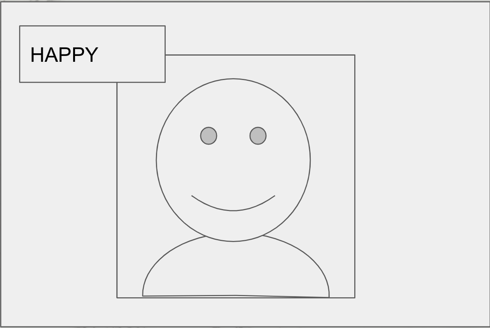

# Team DOSA: MAKERS FINAL PROJECT

## Machine Learning Group: Facial Expression Recognition

**Project Objective:** This will mainly be a learning project, as Machine Learning is an area that is new to us. Nevertheless, we have an “MVP” to aim for, that will serve as a demonstration of our learning.

**MVP**: _We will develop an image classification machine learning algorithm for facial expression recognition: it looks at a photo of a face and can determine what emotion is expressed_



## Getting started

To try out our MVP demo, first clone our repository:

```bash
git clone git@github.com:Harrison25000/DOSA_dontworrybehappy.git

```

You may like to set up a virtual environment, e.g. as described by [EmoPy](https://github.com/thoughtworksarts/EmoPy#environment-setup)* (You could use the `requirements.txt` and `setup.py` files from their repository to set up requirements).

Substitute `python3.6` with whatever `python` you are using.

```bash
sudo pip install virtualenv
python3.6 -m venv venv
source venv/bin/activate
pip install -r requirements.txt

// Note: `deactivate` command to deactivate the virtual environment
```

**\*** *...which you should totally have a look at if you like, because EmoPy was one of the resources we looked at when first learning about image classification*

Then you can try out our demo:

```bash
cd webcam_test

python3.6 final_webcam.py

```

Have fun!